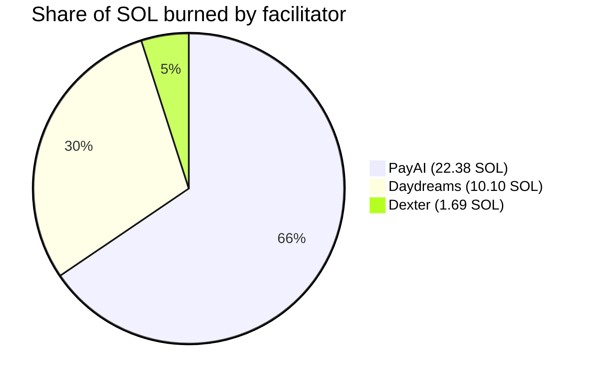
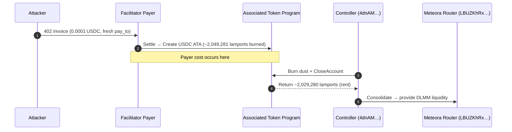
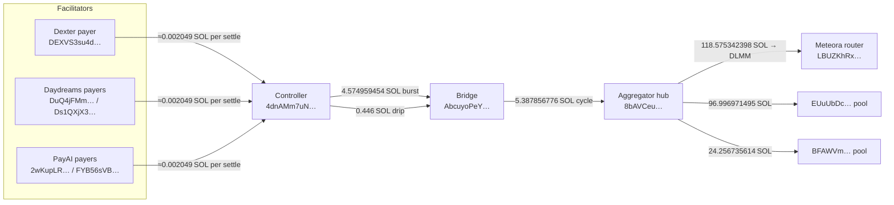

# Solana x402 Rent‑Farm — Consolidated Incident Report

**Window:** 2025‑10‑27 → 2025‑11‑01 (UTC)
**Scope:** Dexter, Daydreams, PayAI facilitators on Solana

> TL;DR — Attackers are rent‑farming x402 settles by forcing creation of fresh USDC Associated Token Accounts (ATAs). Each settle burns ~2,049,281 lamports (≈0.002049 SOL). Minutes later they close those ATAs to claw the rent back. Aggregate impact in-window: **16,674 events**, **~34.17 SOL** burned across all three facilitators. 

---

## Contents

* [Executive Summary](#executive-summary)
* [Impact Overview](#impact-overview)
* [Attack Mechanics](#attack-mechanics)
* [Funds Flow Map](#funds-flow-map)
* [Representative Evidence (Txs)](#representative-evidence-txs)
* [Economics per Event](#economics-per-event)
* [Mitigations](#mitigations)
* [Appendix A — Addresses](#appendix-a--addresses)
* [Appendix B — Methodology](#appendix-b--methodology)

---

## Executive Summary

Across three public x402 facilitators, we identified **16,674** settlements that match the same fingerprint: 0.0001 USDC invoice → payer creates a brand-new USDC ATA (≈2,049,281 lamports burned) → controller wallet executes `BurnChecked` + `CloseAccount` to reclaim the rent. Aggregate burn during 2025‑10‑27 → 2025‑11‑01 is **~34.17 SOL**. 

* **PayAI:** 10,923 events, ~22.3823 SOL burned. 
* **Daydreams:** 4,927 events, ~10.0968 SOL burned. 
* **Dexter:** 824 events, ~1.6886 SOL burned. 

This is not an x402 protocol bug; it’s economic abuse of Solana ATA creation under permissive settlement policies. (See [Mitigations](#mitigations).) 

---

## Impact Overview

**By Facilitator (Solana Mainnet, UTC):**

| Facilitator   | Payer wallet(s)                                                                                  | Time span                                 | Rent-farm settles |                    Lamports burned | SOL burned (≈) | Unique recipient wallets |
| ------------- | ------------------------------------------------------------------------------------------------ | ----------------------------------------- | ----------------: | ---------------------------------: | -------------: | -----------------------: |
| **PayAI**     | `2wKupLR9q6wXYppw8Gr2NvWxKBUqm4PPJKkQfoxHDBg4` `FYB56sVBW2r4Ka7W9kdJWTPY9FKQLxbT6h4Ysr6aLPZD` | 2025‑10‑27 01:02:20 → 2025‑10‑29 19:41:04 |        **10,923** |                 **22,382,257,083** |    **22.3823** |                   8,996  |
| **Daydreams** | `DuQ4jFMmVABWGxabYHFkGzdyeJgS1hp4wrRuCtsJgT9a` `Ds1QXjX3J7XYtu6SWfgjEWhqEWKyLNXGEqUXNhJRNgoP` | 2025‑10‑27 09:09:12 → 2025‑11‑01 05:34:59 |         **4,927** |                 **10,096,808,487** |    **10.0968** |                   3,194  |
| **Dexter**    | `DEXVS3su4dZQWTvvPnLDJLRK1CeeKG6K3QqdzthgAkNV`                                                   | 2025‑10‑27 05:32:57 → 2025‑11‑01 11:51:06 |           **824** |                  **1,688,607,544** |     **1.6886** |                     417  |
| **Totals**    | —                                                                                                | —                                         |        **16,674** | **34,167,672,114–34,167,673,114**† |     **~34.17** |               **12,607** |

† The per-row sum differs from the aggregate by **1,000 lamports** (0.000001 SOL), likely from rounding or a single non-canonical lamport delta in the window. Numbers match the source docs. 

---

## Attack Mechanics

1. **Invoice:** Attacker issues a 402 challenge for **0.0001 USDC** with `pay_to` set to a fresh wallet. 
2. **Settle & ATA creation:** Facilitator payer settles → USDC **ATA is created**, burning ~**2,049,281 lamports** (≈0.002049 SOL).  
3. **Rent reclaim:** Controller wallet **`4dnAM…`** submits `BurnChecked` + `CloseAccount`, clawing back ~**2,029,280 lamports** per close.  
4. **Cycle:** Steps 1–3 repeat across thousands of one-off wallets; funds consolidate and are redeployed into liquidity. 

**Note:** The same controller and downstream wallets appear in the Daydreams & PayAI traces as well as the cross-facilitator investigation.  

---

## Funds Flow Map

Recurring transfers show harvested lamports moving through a **controller → bridge → hub → DLMM pools** pipeline, fed by all three facilitators.  

---

## Representative Evidence (Txs)

**Daydreams sample (settle & refund):** 

* Settle (ATA creation, +2,049,281 lamports):
  [`32FanVALyh4nKzrsgjnsaEyahhJoRkdayuUoGzW5Lof8vNrPKw3Y2gfcfgRuS441HD2eiEgpnz4dZN8qx9hrjfef`](https://explorer.solana.com/tx/32FanVALyh4nKzrsgjnsaEyahhJoRkdayuUoGzW5Lof8vNrPKw3Y2gfcfgRuS441HD2eiEgpnz4dZN8qx9hrjfef)
* Refund (close, −2,029,280 lamports):
  [`3jPHfkM6TmHzMxmCV734PcBTyBEPY4xDUHVVMzShjsibRETr6i1XR7sudJncqJG9hUn9fzY6sfvXV2YP8L62cJbG`](https://explorer.solana.com/tx/3jPHfkM6TmHzMxmCV734PcBTyBEPY4xDUHVVMzShjsibRETr6i1XR7sudJncqJG9hUn9fzY6sfvXV2YP8L62cJbG)

**PayAI sample (settle & refund):** 

* Settle (ATA creation, +2,049,281 lamports):
  [`3bE49TZWGbbJepprdTSZVkf3ozXMDf8QhdJwq2vTz6824jbBHFZa4BBinLVeUEo6uwqeFq4JM3KfmphwU2bUb6L5`](https://explorer.solana.com/tx/3bE49TZWGbbJepprdTSZVkf3ozXMDf8QhdJwq2vTz6824jbBHFZa4BBinLVeUEo6uwqeFq4JM3KfmphwU2bUb6L5)
* Refund (close, −2,029,280 lamports):
  [`7oeKGDSsg8ZrDr2H7DCwas16ixL4jpswSDj3ZMCJC8bBBEc8jNjLX966bnhxJhEX7szyXbgCoUyrNQcwwiYXisq`](https://explorer.solana.com/tx/7oeKGDSsg8ZrDr2H7DCwas16ixL4jpswSDj3ZMCJC8bBBEc8jNjLX966bnhxJhEX7szyXbgCoUyrNQcwwiYXisq)

**Dexter sample (settles):** 

* Settle (ATA creation, +2,049,281 lamports):
  [`2zvHC7h7DtaQxaPZTLLXg6r2BAn4hwUjk4VoYo59KpEUmFJ22hovkRgbCD7NhFBj4zLcNGFpx7c1F9LPcQMSjMFq`](https://explorer.solana.com/tx/2zvHC7h7DtaQxaPZTLLXg6r2BAn4hwUjk4VoYo59KpEUmFJ22hovkRgbCD7NhFBj4zLcNGFpx7c1F9LPcQMSjMFq)
* Settle (ATA creation, +2,049,281 lamports):
  [`Z1atUX2PFGFqpSQfYe3TuedE4sjZDUaoeMKKqoZMnMZKKXhpxsMkZY1jmdeJVBxpUtZkk1u2WhJKqoQi1Zf3GHU`](https://explorer.solana.com/tx/Z1atUX2PFGFqpSQfYe3TuedE4sjZDUaoeMKKqoZMnMZKKXhpxsMkZY1jmdeJVBxpUtZkk1u2WhJKqoQi1Zf3GHU)

---

## Economics per Event

* **Payer burn on ATA creation:** ~**2,049,281 lamports** (≈0.002049 SOL).  
* **Rent reclaimed on close:** ~**2,029,280 lamports** to the attacker’s controller wallet.  
* **Observed gap:** **~20,001 lamports** per loop (fees/spread). Net attacker profit ≈ reclaimed rent minus their own tx fees. 

---

## Mitigations

**Priority 0 — Block the vector**

1. **Allowlist payees**: Only settle to approved `pay_to` treasuries/partners. Shuts down the rent-farm entirely. 
2. **No new ATAs for unknowns**: Reject any settlement that would **create** a recipient ATA unless the payee is allowlisted. Amount thresholds help as a coarse filter but aren’t sufficient alone.  

**Priority 1 — Detection & hygiene**

* **Alerting**: Trigger when a payer funds **ATA creation** with payout ≤ 0.0001 USDC. 
* **Pre-create ATAs** for allowlisted counterparties to avoid surprise rent at settle-time. 
* **Peer coordination**: Share blocklists & fingerprints across facilitators (Dexter, Daydreams, PayAI). 

---

## Appendix A — Addresses

* **Controller (closes ATAs):** `4dnAMm7uNQLJiKVbAtJ82tdhKUCBMUKxjA8fnyLoTa1J` 
* **Bridge:** `AbcuyoPe…` → **Hub:** `8bAVCe…` → **Router (Meteora DLMM):** `LBUZKhRx…`  
* **Payers:**

  * Daydreams — `DuQ4jFMm…`, `Ds1QXjX3…` 
  * PayAI — `2wKupLR…`, `FYB56sVB…` 
  * Dexter — `DEXVS3su4d…` 

---

## Appendix B — Methodology

* **Source**: Helius `getTransactionsForAddress`, `transactionDetails: "full"`, `status: "succeeded"`. 
* **Filter**: Token post-balance ≤ 100 raw units (0.0001 USDC) to non-payer address **and** lamport delta ≈ 2,049,281 on settle; matched to a close by the controller wallet recovering ~2,029,280 lamports.  
* **Window**: 2025‑10‑27 through 2025‑11‑01 (UTC) — bounded by available payer history at time of pull. 

---

*Prepared for facilitator operators & ecosystem peers. Feel free to reuse verbatim.*
