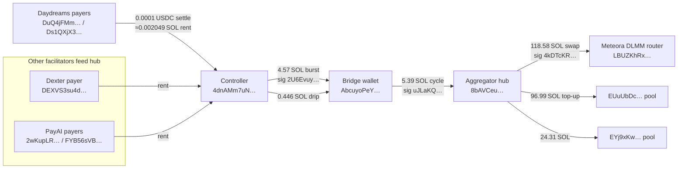

# Solana x402 Rent-Farm Impact Report – Daydreams Facilitator  
  
## Executive Summary  
  
Between 2025‑10‑27 and 2025‑11‑01 the Daydreams x402 facilitator on Solana processed **4 927** sub-cent settlements that match the known rent-farming pattern (0.0001 USDC invoice, new USDC associated token account, immediate close-out by the attacker). Those events consumed **10 096 808 487 lamports**—approximately **10.10 SOL**—from Daydreams’ payer wallets before the attacker reclaimed the rent.  
  
For context, the same pattern hit the other public facilitators during the same window: Dexter lost ~1.69 SOL (824 events) and PayAI lost ~22.38 SOL (10 923 events). All three networks share the same on-chain signatures and the same controller wallet (`4dnAMm7uNQLJiKVbAtJ82tdhKUCBMUKxjA8fnyLoTa1J`) closing the accounts.  
  
## Quantified Impact (Solana Mainnet)  
  
| Facilitator | Payer wallets | Time span (UTC) | Rent-farm settles | Lamports burned | SOL burned (≈) | Unique recipient wallets |  
|-------------|---------------|-----------------|-------------------|-----------------|---------------|--------------------------|  
| **Daydreams** | `DuQ4jFMmVABWGxabYHFkGzdyeJgS1hp4wrRuCtsJgT9a` `Ds1QXjX3J7XYtu6SWfgjEWhqEWKyLNXGEqUXNhJRNgoP` | 2025‑10‑27 09:09:12 → 2025‑11‑01 05:34:59 | **4 927** | **10 096 808 487** | **10.0968** | 3 194 |  
| Dexter | `DEXVS3su4dZQWTvvPnLDJLRK1CeeKG6K3QqdzthgAkNV` | 2025‑10‑27 05:32:57 → 2025‑11‑01 11:51:06 | 824 | 1 688 607 544 | 1.6886 | 417 |  
| PayAI | `2wKupLR9q6wXYppw8Gr2NvWxKBUqm4PPJKkQfoxHDBg4` `FYB56sVBW2r4Ka7W9kdJWTPY9FKQLxbT6h4Ysr6aLPZD` | 2025‑10‑27 01:02:20 → 2025‑10‑29 19:41:04 | 10 923 | 22 382 257 083 | 22.3823 | 8 996 |  
  
## Attack Pattern  
  
1. The attacker emits a 402 invoice for 0.0001 USDC with `pay_to` set to a fresh wallet (e.g., `6wbeeivx4F5htuWF8vNeG5BYiRQQNEa2EUS7dgDLKucP`).  
2. Daydreams’ payer (`DuQ4…` or `Ds1QX…`) settles the invoice, triggering the Associated Token Program and burning ~0.002049 SOL in rent to create the recipient’s USDC ATA.  
3. Minutes later the controller wallet `4dnAMm7uNQLJiKVbAtJ82tdhKUCBMUKxjA8fnyLoTa1J` sends `BurnChecked` + `CloseAccount`, reclaiming the rent.  
4. Steps 1–3 repeat across thousands of one-off wallets, quickly draining the payer.  
  
### Representative Transactions  
  
- **Rent-farm settle:** `32FanVALyh4nKzrsgjnsaEyahhJoRkdayuUoGzW5Lof8vNrPKw3Y2gfcfgRuS441HD2eiEgpnz4dZN8qx9hrjfef` (2025‑10‑30 15:37 UTC) — payer `DuQ4…`, 0.0001 USDC, lamport delta **+2 049 281**.  
- **Rent refund:** `3jPHfkM6TmHzMxmCV734PcBTyBEPY4xDUHVVMzShjsibRETr6i1XR7sudJncqJG9hUn9fzY6sfvXV2YP8L62cJbG` (2025‑10‑27 16:51 UTC) — signer `4dnAM…`, lamport delta **−2 029 280** (rent returned to attacker).  
  
## Liquidity Recycling Map (2025‑11‑01 Update)  
  
Daydreams’ rent losses do not stay idle. Analysis of the latest 2 000 controller transactions shows the lamports flowing through a predictable chain before being recycled into Meteora DLMM liquidity positions:  
  
- **Daydreams payers → Controller:** each 0.0001 USDC invoice burns ~0.002049 SOL that lands in the controller (`4dnAM…`).  
- **Controller → Bridge:** the controller periodically empties its balance into `AbcuyoPe…`, including a **4.574959454 SOL** burst seen in signature `2U6Evuy…` plus smaller **0.446 SOL** drips.  
- **Bridge → Hub:** the bridge wallet forwards roughly **5.387856776 SOL** per cycle (`uJLaKQ…`) into an aggregator wallet `8bAVCe…` that also collects rent from Dexter and PayAI.  
- **Hub → Meteora:** the aggregator re-deploys funds via the Meteora router (`LBUZKhRx…`), pushing **118.575342398 SOL** (`4kDTcKR…`) into `EYj9xKw…` and topping up `EUuUbDc…` by **96.996971495 SOL**.  
  

  
## Recommendations for Daydreams  
  
1. **Allowlist payees:** Only settle invoices whose `pay_to` address matches a pre-approved treasury or partner wallet. This closes the rent-farm vector entirely.  
2. **Temporary guardrail:** Reject or flag sub-cent invoices that would create a new ATA (≤ 0.001 USDC) until the allowlist is in place.  
3. **Monitoring:** Alert whenever the payer triggers an ATA creation with a payout ≤ 0.0001 USDC, so new rent-farm wallets are caught immediately.  
4. **Peer coordination:** Share these figures with other facilitator operators (Dexter, PayAI) to align on protections and blocklists.  
  
## Methodology  
  
- **Data source:** Helius `getTransactionsForAddress` with `transactionDetails: "full"`, `status: "succeeded"`, paginated until no further results.  
- **Pattern filter:** Token post-balance amount ≤ 100 (0.0001 USDC) to an address other than the payer, with lamport delta ≈ 2 049 281.  
- **Period analysed:** 2025‑10‑27 through 2025‑11‑01 (the range returned by the payer’s settlement history at the time of analysis).  
