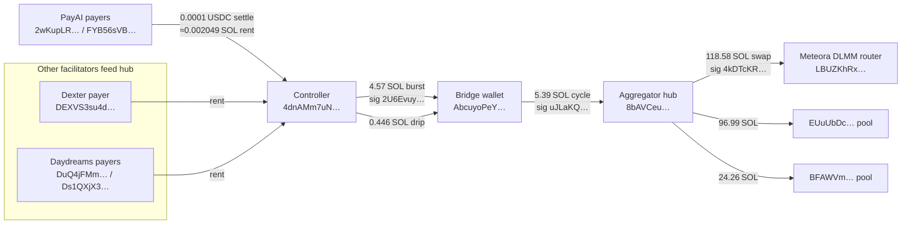

# Solana x402 Rent-Farm Impact Report – PayAI Facilitator  
  
## Executive Summary  
  
Between 2025‑10‑27 and 2025‑10‑29 the PayAI x402 facilitator on Solana processed **10 923** sub-cent settlements matching the rent-farm pattern. Those events burned **22 382 257 083 lamports**—approximately **22.38 SOL**—from PayAI’s payer wallets before the attacker reclaimed the rent by closing each newly created USDC associated token account (ATA).  
  
For comparison, Dexter lost ~1.69 SOL (824 events) and Daydreams lost ~10.10 SOL (4 927 events) to the same scheme. All three facilitators show the same on-chain fingerprint: 0.0001 USDC invoices, ATA creation, and immediate `BurnChecked` + `CloseAccount` transactions signed by `4dnAMm7uNQLJiKVbAtJ82tdhKUCBMUKxjA8fnyLoTa1J`.  
  
## Quantified Impact (Solana Mainnet)  
  
| Facilitator | Payer wallets | Time span (UTC) | Rent-farm settles | Lamports burned | SOL burned (≈) | Unique recipient wallets |  
|-------------|---------------|-----------------|-------------------|-----------------|---------------|--------------------------|  
| **PayAI** | `2wKupLR9q6wXYppw8Gr2NvWxKBUqm4PPJKkQfoxHDBg4` `FYB56sVBW2r4Ka7W9kdJWTPY9FKQLxbT6h4Ysr6aLPZD` | 2025‑10‑27 01:02:20 → 2025‑10‑29 19:41:04 | **10 923** (10 826 + 97) | **22 382 257 083** | **22.3823** | 8 996 |  
| Daydreams | `DuQ4jFMmVABWGxabYHFkGzdyeJgS1hp4wrRuCtsJgT9a` `Ds1QXjX3J7XYtu6SWfgjEWhqEWKyLNXGEqUXNhJRNgoP` | 2025‑10‑27 09:09:12 → 2025‑11‑01 05:34:59 | 4 927 | 10 096 808 487 | 10.0968 | 3 194 |  
| Dexter | `DEXVS3su4dZQWTvvPnLDJLRK1CeeKG6K3QqdzthgAkNV` | 2025‑10‑27 05:32:57 → 2025‑11‑01 11:51:06 | 824 | 1 688 607 544 | 1.6886 | 417 |  
  
## Attack Pattern  
  
1. The attacker issues a 402 invoice for 0.0001 USDC with `pay_to` pointing at a newly generated wallet.  
2. PayAI’s payer (`2wKupLR…` or `FYB56s…`) settles the invoice, triggering the Associated Token Program and burning ~0.002049 SOL to create the recipient’s USDC ATA.  
3. Minutes later the controller wallet `4dnAMm7uNQLJiKVbAtJ82tdhKUCBMUKxjA8fnyLoTa1J` submits `BurnChecked` + `CloseAccount`, reclaiming the rent.  
4. The attacker repeats this loop across thousands of one-off wallets, rapidly draining the payer.  
  
### Representative Transactions  
  
- **Rent-farm settle:** `3bE49TZWGbbJepprdTSZVkf3ozXMDf8QhdJwq2vTz6824jbBHFZa4BBinLVeUEo6uwqeFq4JM3KfmphwU2bUb6L5` (2025‑10‑28 19:33 UTC) — payer `2wKup…`, 0.0001 USDC, lamport delta **+2 049 281**.  
- **Rent refund:** `7oeKGDSsg8ZrDr2H7DCwas16ixL4jpswSDj3ZMCJC8bBBEc8jNjLX966bnhxJhEX7szyXbgCoUyrNQcwwiYXisq` (2025‑10‑29 04:02 UTC) — signer `4dnAM…`, lamport delta **−2 029 280**.  
  
## Liquidity Flow Update (2025‑11‑01)  
  
Tracing the reclaimed rent shows PayAI’s lamports merging with the broader rent-farm operation that fuels Meteora liquidity bots:  
  
- **PayAI payers → Controller:** every 0.0001 USDC settle burns ~0.002049 SOL into the controller wallet `4dnAM…`.  
- **Controller → Bridge:** once the buffer grows, the controller ships the balance to `AbcuyoPe…` (e.g., **4.574959454 SOL** via signature `2U6Evuy…`, plus repeated **0.446 SOL** drips).  
- **Bridge → Hub:** the bridge forwards **5.387856776 SOL** chunks (`uJLaKQ…`) into the aggregator `8bAVCe…`, which also receives identical flows from Dexter and Daydreams.  
- **Hub → Meteora pools:** the aggregator pushes out large transfers—**118.575342398 SOL** (`4kDTcKR…`) to `EYj9xKw…`, **96.996971495 SOL** to `EUuUbDc…`, and **24.256735614 SOL** to `BFAWVm…`—all routed through the Meteora DLMM program `LBUZKhRx…`.  
  

  
## Recommendations for PayAI  
  
1. **Allowlist `pay_to` addresses:** Only settle invoices to approved treasuries or partner wallets. This directly blocks the rent-farm.  
2. **Temporary guardrail:** Reject sub-cent invoices that would create a new ATA (≤ 0.001 USDC) until the allowlist is live.  
3. **Monitoring:** Alert on ATA creation + ≤ 0.0001 USDC payouts so new rent-farm wallets are flagged instantly.  
4. **Coordination:** Share these figures with other facilitators (Dexter, Daydreams) to align on protections and blocklists.  
  
## Methodology  
  
- **Data source:** Helius `getTransactionsForAddress` with `transactionDetails: "full"`, `status: "succeeded"`, paginated until no further results.  
- **Pattern filter:** Token post-balance ≤ 100 raw units (0.0001 USDC) to a non-payer address with lamport delta ≈ 2 049 281.  
- **Period analysed:** 2025‑10‑27 through 2025‑10‑29 (full history returned for the PayAI payer wallets at time of analysis).  
